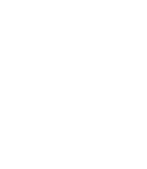

# AP4.0: Java

  

En este repositorio pueden encotrar el codigo de las clases sincronicas del curso JI04: Ruiz - Medone.

Dentro de la carpeta [src](https://github.com/RDJulian/AP4.0Java/tree/master/src) pueden encontrar paquetes
correspondientes a las distintas clases. Desde ahi, pueden ver los distintos archivos, copiar el codigo e incluso
descargar los archivos fuente .java.

Otra alternativa es descargar el repositorio entero, apretando el boton verde "Code" al principio de la pagina, y luego
apretando "Download ZIP".

Para aquellos que separ usar git, les recomendamos clonar el repositorio, ya que vamos a ir actualizandolo.

Ante cualquier consulta, no duden en preguntar por
el [campus](https://campus.argprograma.fi.uba.ar/course/view.php?id=58).